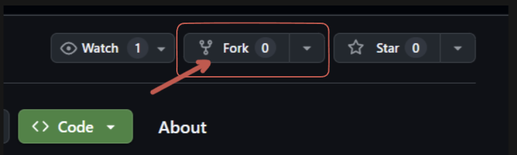
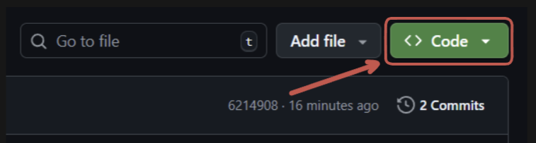
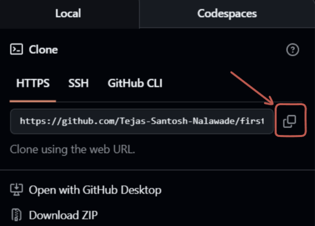
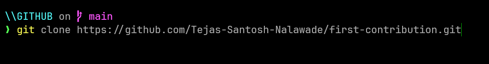
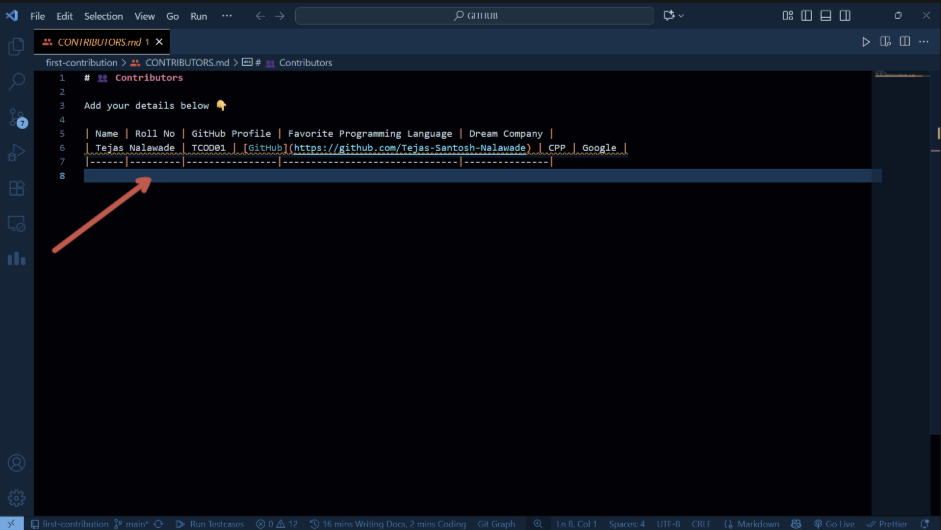
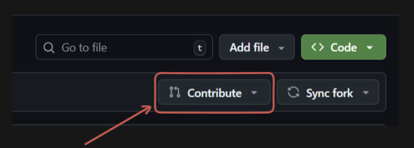
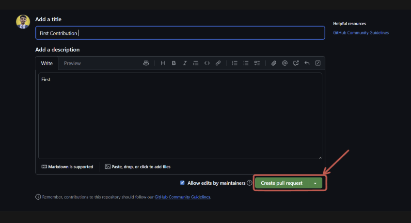

# Step-by-Step Guide: First Contribution

## 1. Fork the Repository

Go to the repository you want to contribute to and click on the **Fork** button at the top right corner.



## 2. Click the Code Button and Copy Path

After forking, click the green **Code** button to reveal the repository URL. Click the copy icon to copy the path.




## 3. Copy the Link and Clone the Repository

After clicking the **Code** button, copy the repository link.



Now, open **Terminal on the Project folder ** on your computer. In the terminal, use the following command to clone your forked repository (replace with your actual link if needed):

```bash
git clone https://github.com/Tejas-Santosh-Nalawade/first-contribution.git
```




You should see output similar to the screenshot above.

To open the project in VS Code, run the following command in your terminal:

```bash
code .
```


## 4. Edit CONTRIBUTORS.md

Navigate into the cloned folder and open the `CONTRIBUTORS.md` file. Add your details as instructed.




## 5. Add, Commit, and Push Your Changes

After saving your changes to `CONTRIBUTORS.md`, run the following commands in Git Bash:

```bash
git add CONTRIBUTORS.md
git commit -m "Add my contribution"
git push origin main
```


## 6. Create a Pull Request

Go to your forked repository on GitHub. Click the **Contribute** button, then select **Open pull request**.




Fill in the title and description, then click **Create pull request**.



Congratulations! You have made your first contribution.
